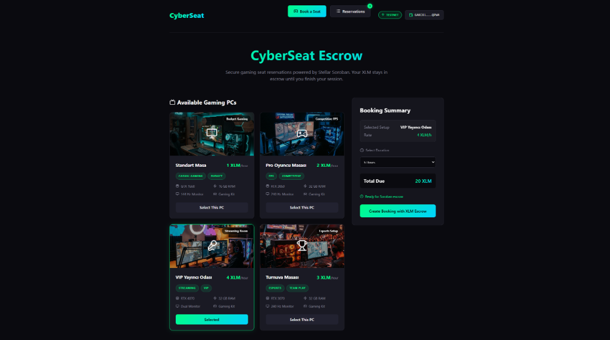
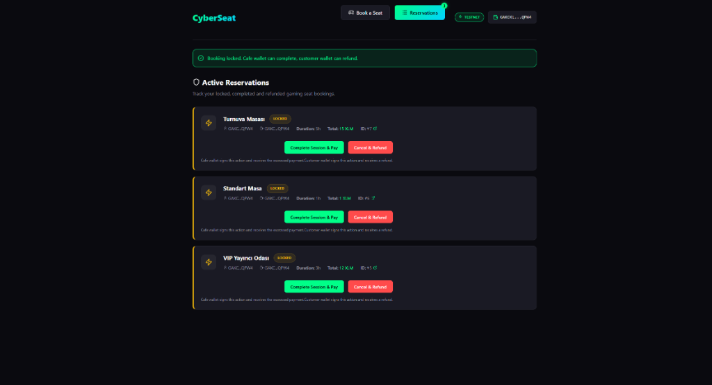
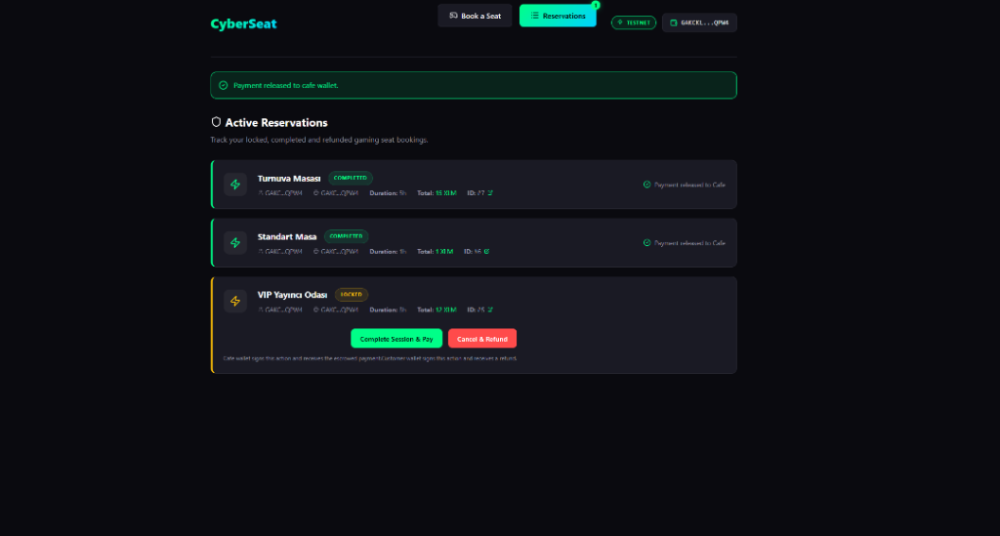

# CyberSeat

### Project Summary
**CyberSeat** is a Soroban-powered internet cafe seat booking app where customers lock XLM in escrow and cafes receive payment after confirming the session.

**Description**:
CyberSeat lets users reserve gaming PCs in an internet cafe with Freighter and Stellar Testnet XLM. The customer creates a booking and locks payment inside a Soroban escrow contract. The cafe wallet can complete the session and receive payment, while the customer can cancel and refund before completion.

---

### Live / Local Status
This is a **hackathon MVP**. It currently runs as a local frontend demo unless deployed. The Soroban contract is deployed on Stellar Testnet.

- **Frontend Demo**: `LOCAL_OR_DEPLOYED_FRONTEND_URL_HERE`
- **GitHub**: `https://github.com/Kudretthan/cyberseat-.git`
- **Soroban Contract ID**: `CAMNK4RKLIMNKQWAVMT7QHIQ6SKPTU42WVHIBDITEPG3OMYGJXHIG7O4`

**Transaction Hashes**:
- **Contract deploy tx hash**: `64a58c53ca83dd062b36bdbcd3bd2f596bc07b825f799131843f2452cba837fa`
- **Create booking tx hash**: `<CREATE_BOOKING_TX_HASH>`
- **Complete payment tx hash**: `<COMPLETE_TX_HASH>`
- **Refund tx hash**: `<REFUND_TX_HASH>`

---

### Demo Wallets
- **Customer wallet**: `GA2IAMTTK2KB5BSO6AUIQWVI5CHELFA6YTQDCMLB2JRK6LZ4HXKOJQSZ`
- **Cafe wallet**: `GAKCKLXUOMY4CA7444ALGWFHTCH4LOGIMNLBLERCO4YA2ARJE7STQPW4`

**Explanation**:
- The customer wallet creates a booking and locks XLM in escrow.
- The cafe wallet completes the reservation and receives the escrowed XLM.
- The customer wallet can cancel/refund before completion.

---

### Screenshots


<br><br>

<br><br>



---

### Features
- Freighter wallet connection
- Stellar Testnet support
- Gaming PC catalog with different prices
- Seat duration selection
- Automatic XLM total calculation
- Soroban escrow booking
- Customer-signed booking creation
- Cafe-signed session completion
- Customer-signed refund
- Active Reservations page
- LocalStorage booking list
- Transaction hash display
- Gaming PC visual cards
- User-friendly wallet authorization states

---

### Seat Catalog

| Seat Type | Price | Specs | Tags |
|-----------|-------|-------|------|
| **Standard Seat** | 1 XLM/hour | GTX 1660, 16 GB RAM, 144 Hz Monitor | Budget / Casual Gaming |
| **Pro Gaming Seat** | 2 XLM/hour | RTX 3060, 32 GB RAM, 240 Hz Monitor | Competitive / FPS |
| **VIP Streaming Room** | 4 XLM/hour | RTX 4070, 32 GB RAM, Dual Monitor | Streaming / VIP |
| **Tournament Seat** | 3 XLM/hour | RTX 3070, 32 GB RAM, 240 Hz Monitor | Esports / Team Play |

---

### Escrow Flow
1. Customer connects Freighter.
2. Customer selects a gaming PC and duration.
3. Customer creates a booking.
4. XLM is transferred from customer wallet to the Soroban escrow contract.
5. Booking appears as **Locked** in Reservations.
6. Cafe wallet connects and sees the booking.
7. Cafe clicks **Complete Session & Pay**.
8. Soroban transfers escrowed XLM to cafe wallet.
9. If the session is cancelled before completion, customer clicks **Cancel & Refund**.
10. Soroban transfers escrowed XLM back to customer wallet.

**Role permissions**:
- **Create booking**: customer signs
- **Complete booking**: cafe signs
- **Refund booking**: customer signs

---

### Tech Stack
- React
- Vite
- TypeScript
- Freighter
- Stellar Testnet
- Soroban Rust Contract
- LocalStorage
- Modern dark UI

---

### Architecture

```
Customer Browser
  ↓
Vite React Frontend
  ↓
Freighter Wallet
  ↓
Stellar Testnet / Soroban Escrow Contract
```

**Data Management**:
The blockchain contract is the source of truth for escrow logic. localStorage is only used for displaying bookings in the MVP.

---

### Environment Variables

```env
VITE_STELLAR_NETWORK=testnet
VITE_STELLAR_RPC_URL=https://soroban-testnet.stellar.org
VITE_CYBERSEAT_CONTRACT_ID=your_deployed_contract_id
VITE_XLM_TOKEN_CONTRACT_ID=CDLZFC3SYJYDZT7K67VZ75HPJVIEUVNIXF47ZG2FB2RMQQVU2HHGCYSC
VITE_CAFE_WALLET_ADDRESS=GAKCKLXUOMY4CA7444ALGWFHTCH4LOGIMNLBLERCO4YA2ARJE7STQPW4
```

**Notes**:
- Do not commit private keys.
- Freighter must be on Testnet.
- `VITE_CYBERSEAT_CONTRACT_ID` must be updated after every new contract deployment.
- If env values change, restart the frontend dev server.

---

### Contract Functions
- `init(admin, xlm_token)`
- `create_booking(customer, cafe, amount, seat_code, hours)`
- `complete_booking(booking_id)`
- `cancel_booking(booking_id)`
- `get_booking(booking_id)`
- `get_booking_count()`

**Amount Handling**:
Amount is sent as integer stroops-like units. 1 XLM = 10,000,000 units.
Example: 3 XLM = 30,000,000 units.

---

### Demo Script
1. Connect customer wallet.
2. Choose VIP Streaming Room or Pro Gaming Seat.
3. Select duration.
4. Create booking with XLM escrow.
5. Open Reservations.
6. Switch to cafe wallet.
7. Complete session and pay cafe.
8. Show completed status and transaction hash.
9. Optionally create another booking and cancel/refund with customer wallet.

---

### Limitations
- Hackathon MVP
- Stellar Testnet only
- Testnet XLM has no real value
- No backend database
- Bookings displayed with localStorage
- No dispute system
- No real-time cafe admin dashboard
- No time-based automatic release
- Contract needs audit before production
